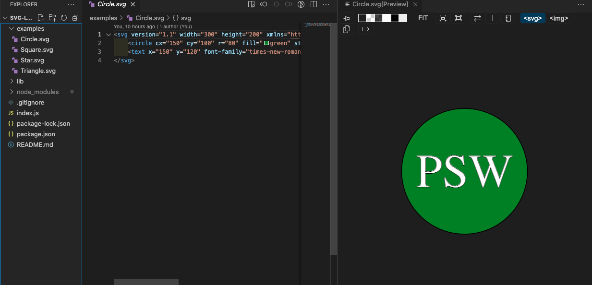
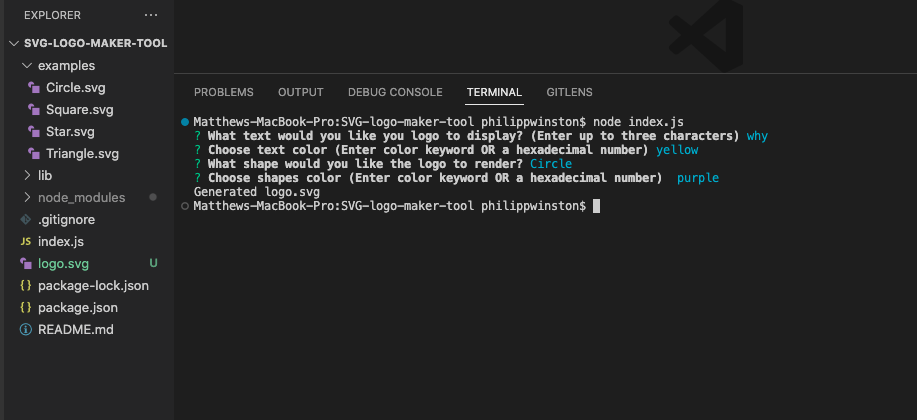
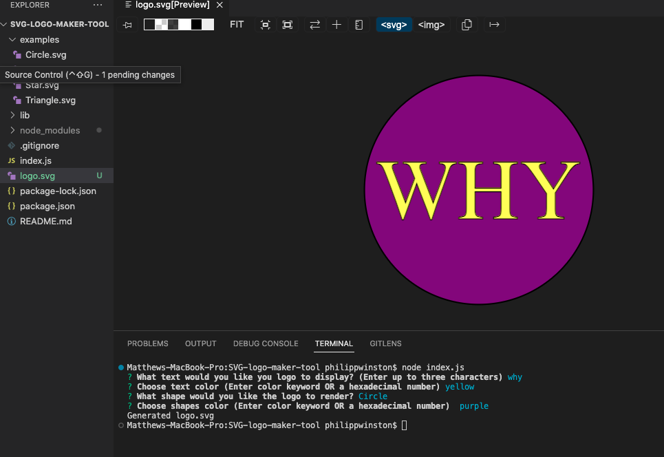
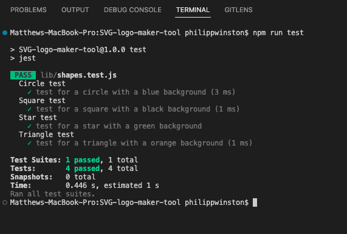

# SVG Logo Generator

## [License](#license)

No license was used for this project.

## [Description](#table-of-contents)

The SVG logo generator is a program that uses inquirer, node, and jest to generate a SVG logo with prompts and user input. Using just it can test the shapes confirming them against examples given.

## Table of Contents

- [Description](#discription)
- [Installation](#installation)
- [Usage](#usage)
- [Credits](#credits)

- [Tests](#tests)
- [License](#license)
- [Questions](#questions)

## [Installation](#table-of-contents)

Upon cloning the repository in your preferred method into a directories of your choice using the terminal. Open VS code or your preferred work environment and confirm you're in the root directory of `SVG-logo-maker-tool` At this point you need to run `NPM i` call the dependencies and then `node index.js` To run the program.

## [Usage](#table-of-contents)

Check out the usage demo [Here](https://drive.google.com/file/d/1selDs-NpNJ-kpHWb4cfb4q1KSi8AoUkI/view)

After installation of the repositories complete, run the following code in the terminal `node index.js`. answer the prompts 

and as you complete each one you will see a log of your answers and upon completion see a message that says `Generated logo.svg` 

it Will be ready for your preview with VS code's SVG preview or opening the file in your preferred browser. from there it is ready for you to export to your latest project.

Reference this video if you need further assistance

## [credits](#table-of-contents)

MDN Web Docs [SVG Getting Started](https://developer.mozilla.org/en-US/docs/Web/SVG/Tutorial/Getting_Started)

Thank you for your interest in helping out; however, I will not be accepting contributions from third parties.

## [Tests](#table-of-contents)

In the terminal, type in `npm run test` and in the terminal you will see logged the test status of the shapes.test.js suite. It will test the four shapes

## [Questions](#table-of-contents)

Please contact me using the following links:
[GitHub](https://github.com/Philippwinston)
[Email: philippwinston@gmail.com](mailto:philippwinston@gmail.com)

---
